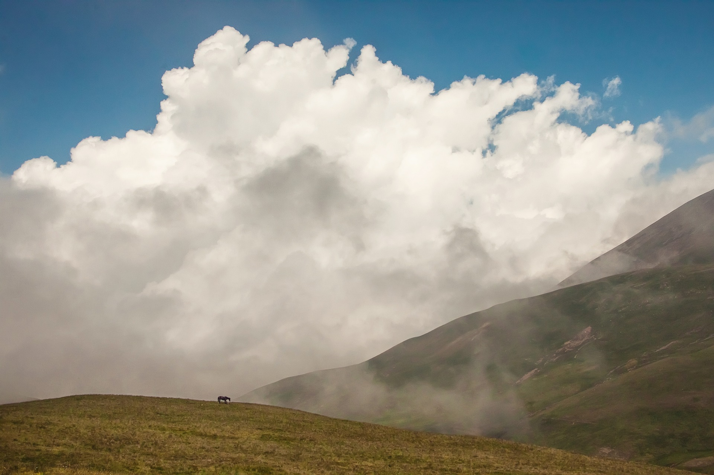
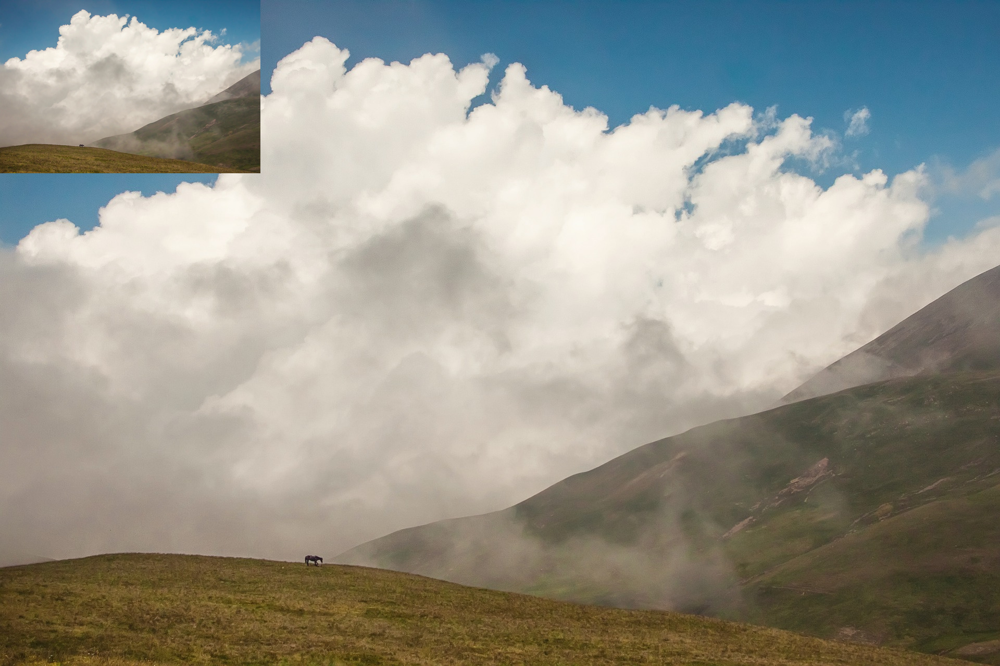
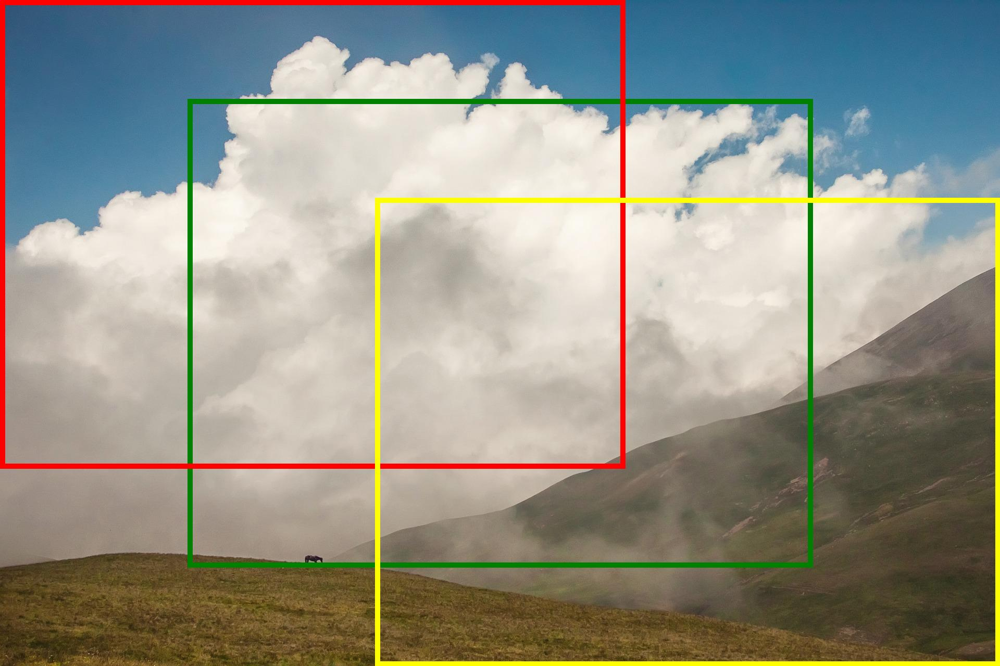
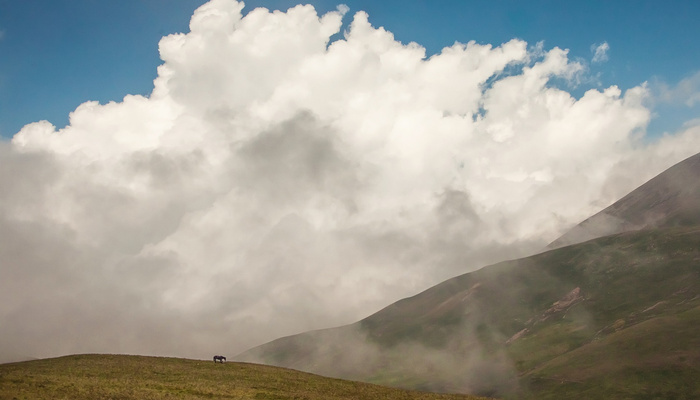
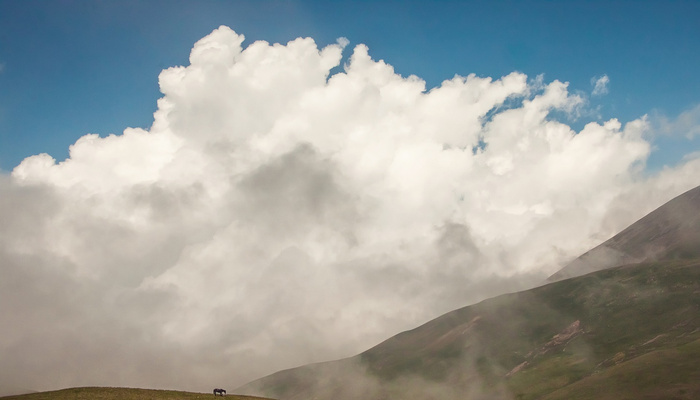

# Image resizer
This is a generic image resizer. You can use it to shrink or expand images to maximum sizes. By choosing a crop strategy you can cut the image on an exact pixel size. It uses the pillow lirbary for the image working.
# Installation
The usage requires the pillow lirbary. You can install it with pip:
```
pip install pillow
```
# Usage
You can use the resizer in three ways:
<ul>
    <li>Resizing images</li>
    <li>Crop an image in exact dimensions</li>
    <li>Combining resizing and cropping</li>
</ul>

The resizing and cropping happens in the ImageResizer class. When you want to crop an image, you import a crop strategy (see down below). To execute the resizing process you simply run the ImageResizer.run() method.
## The Image Resizer Class

The Image resizer has the following parameters:

```python
ImageResizer(picpath: str, 
            savepath: str, 
            crop_strategy: Crop = None,
            min_width: int = 0,
            min_height: int = 0,
            max_width: int = None,
            max_height: int = None,
            )
```
<ul>
    <li><strong>picpath</strong>: The path to the image. I recommend os.path.join() for that.</li>
    <li><strong>savepath</strong>: The path where the new image has to be saved. When you save the image you can provide a suffix of the common images from <a href="https://pillow.readthedocs.io/en/stable/handbook/image-file-formats.html?highlight=writer">Pillow Image file formats</a>. I recommend os.path.join() for the path.</li>
    <li><strong>crop_strategy</strong>: Default is None. When you want to crop the image you choose the crop strategy and pass it here.</li>
    <li><strong>min_width & min_height</strong>: Defaults are 0. If your image has a minimum size you can pass it here. Just pass the values you need. The image will expand with locked aspect ratio.</li>
    <li><strong>max_width & max_height</strong>: Defaults are set to the original image width and height when you leave it empty. This is the maximum width and height an image will have. You just need to pass the values you need. The image will be shrink with locked aspect ratio.</li>
</ul>

## Resizing Images with maximum values
For resizing you can set minimum and/or maximum pixels. The actual resizing will happen with locked aspect ratio. Here we have a simple example how you can shrink an image. The example image has a size of 1920 * 1280 so we can leave the minumum values at the default 0. This is the image we will shrink:<br />
<br />
Our goal is to set the image to maximum size 500 * 400.

```python
import os
from imageresizer import ImageResizer

imgpath = os.path.join("examples", "example.jpg")
safepath = os.path.join("examples", "output1.jpg")

resizer = ImageResizer(imgpath, safepath, max_width=500, max_height=400)
resizer.run()
```
The resized image looks quite the same but the size is now 500 * 333 because the aspect ratio is locked now. When you look at both images combined you see the difference.<br />
<br />

## Crop an image
If you want to crop an image you can choose between nine regular crop strategies. This is the place where the image is cut. You can cut it horizontal and vertical. The nine strategies are:
<ul>
    <li>cropTopLeft</li>
    <li>cropTopCenter</li>
    <li>cropTopRight</li>
    <li>cropMiddleLeft</li>
    <li>cropMiddleCenter</li>
    <li>cropMiddleRight</li>
    <li>cropBottomLeft</li>
    <li>cropBottomCenter</li>
    <li>cropBottomRight</li>
</ul>
Here is a little help where a 1200px * 900px image can be cut at topLeft (red), middleCenter(green) and bottomRight (yellow). <br />
<br />
Now let's look at an example. We use the original example and cut it at MiddleCenter. We will use a 1200 * 900 form. The crop strategy just needs a tuple with the size.

```python
import os
from imageresizer import ImageResizer
from imageresizer.cropstrategies import cropMiddleCenter

imgpath = os.path.join("examples", "example.jpg")
safepath = os.path.join("examples", "output2.jpg")
# The strategy needs a tuple
crop = cropMiddleCenter((1200, 900))

resizer = ImageResizer(imgpath, safepath, crop)
resizer.run()
```
The result is the square image which is cropped in the middle center (the green rectangle above).<br />
<br />

## Combining resizing and cropping
Let's try to combine resizing and cropping. We want a 700 * 400 image but first we need to shrink the image as much as possible. You just need to equal the crop strategy size with the maximum width and height.
```python
from imageresizer import ImageResizer
from imageresizer.cropstrategies import cropMiddleCenter

imgpath = os.path.join("examples", "example.jpg")
safepath = os.path.join("examples", "output3.jpg")
crop = cropMiddleCenter((700, 400))

resizer = ImageResizer(imgpath, safepath, crop, max_width=700, max_height=400)
resizer.run()
```
<br />
The output is nice but not optimal. when we change the crop strategy to cropTopCenter with:

```python
import os
from imageresizer import ImageResizer
from imageresizer.cropstrategies import cropTopCenter

imgpath = os.path.join("examples", "example.jpg")
safepath = os.path.join("examples", "output4.jpg")
crop = cropTopCenter((700, 400))

resizer = ImageResizer(imgpath, safepath, crop, max_width=700, max_height=400)
resizer.run()
```
Now the output is better because the clouds are on it completly.<br />

<br />

## Custom strategy
If you know exacly where you want to start you can choose the cropCustom strategy. You also need to pass the size at first and seccond the x and y positions (x is horizontal, y vertical, zero is top left) also as a tuple.

```python
imgpath = os.path.join("examples", "example.jpg")
safepath = os.path.join("examples", "output5.jpg")

crop = cropCustom((400,400), (250,250))

resizer = ImageResizer(imgpath, safepath, crop)
resizer.run()
```
